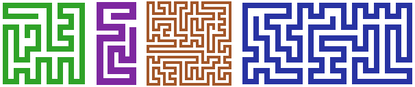

HamPath
=======

A library for generating random looking Hamiltonian paths on a grid.



Use
---

To generate a Hamiltonian path object:

```javascript
var pathOptions = { // No options are required
    width : 12, // width of the grid, default : 8
    height : 12, // height of the grid, default : 8
}; 
var path = hamPath.generate(pathOptions);
```

The `path` object generated has the form:
 
```javascript
path = {
    start : [1, 3], // Coordinates of the start of the path
    end : [2, 6], // Coordinates of the end of the path
    data : [[1, 3], ... [2, 6]] // Sequence of nodes along the path
}
```

To generate a canvas element displaying this path there is a `draw` function that returns a HTML canvas element: 

```javascript
var drawOptions = {
    width : 32, // Width of the canvas in pixels
    color : '#C00000', // Color of the path
    background : '#FFFFFF', // Background color
    thickness : 0.5 // Relative thickness (0 to 1) of the path to the grid size
}
var canvas = hamPath.draw(path, drawOptions);
document.body.appendChild(canvas);
```

Again, all the options are optional. The canvas height is set to maintain the aspect ratio of the path, i.e. for a square path path width = path height and so canvas width = canvas height.


License
-------

[WTFPL](http://www.wtfpl.net/)